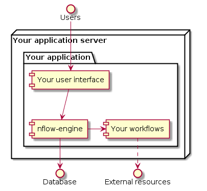
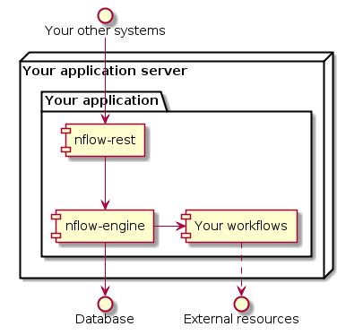
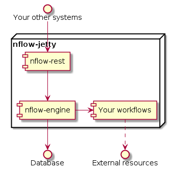

# nFlow [](https://travis-ci.org/NitorCreations/nflow)

nFlow is a light weight business process engine with emphasis on the following goals or features.

* **Conciseness:** effort put on making the writing the workflow definitions easy
* **Modularity:** you can pick the desired components from nFlow stack or use it as standalone server
* **Deployment:** startup in seconds instead of minutes, effort put on supporting many scenarios
 
nFlow non-goals are important to understand as well:

* **BPMN/BPEL Support:** excluded by the goal of conciseness
* **Full UI Support:** although read-only visualization of workflows is in future roadmap

# Table of Contents

* [Getting Started](#getting-started)
  * [1 Minute Guide](#one-minute-guide)
  * [Components](#components)
  * [Usage Scenarios](#usage-scenarios)
    * [Scenario 1: Embedded Engine Only](#usage-scenarios-embedded-engine-only)
    * [Scenario 2: Inside Your Application Server](#usage-scenarios-inside-your-application-server)
    * [Scenario 3: Full nFlow Stack](#usage-scenarios-full-nflow-stack)
  * [Anatomy of a Workflow](#anatomy-of-workflow)
    * [Implementation Class and States Declarations](#implementation-class-and-states-declarations)
    * [Settings and State Transitions](#settings-and-state-transitions)
    * [State Handler Methods](#state-handler-methods)
  * [Setting Up Your nFlow](#setting-up-your-nflow)
    * [Using Spring Framework](#using-spring-framework)
    * [Without Spring Framework](#using-spring-framework)
  * [Interacting with nFlow](#interacting-with-nflow)
    * [StateExecution -interface](#stateexecution-interface)
    * [State Variables](#state-variables)
    * [WorkflowSettings -interface](#workflow-settings)
* [Configuration](#configuration)
  * [nFlow Properties](#nflow-properties)
    * [nflow-engine](#nflow-properties-nflow-engine)
    * [nflow-rest-api](#nflow-properties-nflow-rest-api)
    * [nflow-jetty](#nflow-properties-nflow-jetty)
  * [Database](#database)
    * [Create nFlow Database](#database-create-nflow-database)
    * [Initialize and Use nFlow Database](database-initialize-and-use-nflow-database)
  * [Security](#security)
  * [Logging](#logging)
* [Other Stuff](#other-stuff)
  * [Versioning](#versioning)
  * [REST API](#rest-api)
  * [Licence](#licence)

# <a name="getting-started"></a>Getting Started

## <a name="one-minute-guide"></a>1 Minute Guide

Create a Maven project. Add the following to your  `pom.xml`. nFlow is available in Maven central repository. 

```xml
<dependency>
  <groupId>com.nitorcreations</groupId>
  <artifactId>nflow-jetty</artifactId>
  <version>0.1.0</version>
</dependency>
```
Create a class for starting nFlow in embedded Jetty using H2 memory database.

```java
import com.nitorcreations.nflow.jetty.StartNflow;

public class App {
  public static void main(String[] args) throws Exception {
    new StartNflow().startJetty(7500, "local", "");
  }
}
```
That's it! Running `App` will start nFlow server though without any workflow definitions. 
Point your browser to [http://localhost:7500/ui](http://localhost:7500/ui) and you can use interactive online documentation for the nFlow REST API. 

See the next sections for creating your own workflow definitions.

## <a name="components"></a>Components

nFlow consist of the following main components, each having the previous component as a dependency.
 1. **nflow-engine** contains a multithreaded workflow dispatcher, Java API for managing workflows and the persistance layer implementation. 
 2. **nflow-rest-api** contains a JAX-RS compliant REST service implementation for exposing workflow management and query APIs.
 3. **nflow-jetty** contains an embeddable Jetty server for running nFlow with your custom workflows.

In addition, nflow-tests component contains integration tests over demo workflows.

## <a name="usage-scenarios"></a>Usage Scenarios

The following example scenarios illustrate how you can use nFlow with your applications.

### <a name="usage-scenarios-embedded-engine-only"></a>Scenario 1: Embedded Engine Only

Use embedded nflow-engine to run your own workflows inside your own application. 



### <a name="usage-scenarios-inside-your-application-server"></a>Scenario 2: Inside Your Application Server

Same as the previous scenario except you've exposed nFlow services through REST services implemented in nflow-rest-api. You can use any REST stack (e.g. Jersey, Apache CXF, etc) that supports JAX-RS specification. 



### <a name="usage-scenarios-full-nflow-stack"></a>Scenario 3: Full nFlow Stack

Full blown nFlow running on embedded Jetty (nflow-jetty -module). 



## <a name="anatomy-of-workflow"></a>Anatomy of a Workflow

In nFlow terminology, you have workflow definitions and instances. A workflow definition is Java class that contains the implementation of a business process (e.g. credit application process). A workflow instance is a runtime instance of the business process (e.g. credit application from a certain customer). As a developer, you need to implement the workflow definition after which the workflow instances can be submitted through nflow-engine API or nflow-rest-api services.

A workflow can be composed of human tasks (e.g. accept application), technical tasks (e.g. call REST service) or both of these tasks. A simple workflow that involves creating a credit application, the credit decision, possible money transfer and finally closing the credit application is illustrated below. The Java code for `CreditApplicationWorkflow` can be found from [nflow-tests -module](nflow-tests/src/main/java/com/nitorcreations/nflow/tests/demo/CreditApplicationWorkflow.java).


### <a name="implementation-class-and-states-declarations"></a>Implementation Class and States Declarations

`CreditApplicationWorkflow` begins by extending [`WorkflowDefinition`](nflow-engine/src/main/java/com/nitorcreations/nflow/engine/workflow/WorkflowDefinition.java) which is the base class for all workflow implementations in nFlow. The state space of the workflow is enumerated after the class declaration. In this example, the states are also given a type and documentation. The following state types are supported (`WorkflowStateType`-enumeration):
 * **start:** an entry point to the workflow
 * **manual:** requires external state update (usually a human task required)
 * **normal:** state is executed and retried automatically by nFlow
 * **end:** final state to which workflow instance has finished

Currently the state types are informational only and useful for visualization. 

```java
public class CreditApplicationWorkflow extends WorkflowDefinition<State> {
...
  public static enum State implements WorkflowState {
    createCreditApplication(start, "Credit application is persisted to database"),
    acceptCreditApplication(manual, "Manual credit decision is made"),
    grantLoan(normal, "Loan is created to loan system"),
    finishCreditApplication(normal, "Credit application status is set"),
    done(end, "Credit application process finished"),
    error(manual, "Manual processing of failed applications");
...
```
### <a name="settings-and-state-transitions"></a>Settings and State Transitions

Each workflow implementation must have the following properties set through base class constructor:
 * **name:** defines the name that is used when submitting new instances (_creditApplicationProcess_)
 * **default start state:** state from which new instances start by default (_createCreditApplication_)
 * **generic error state:** error state for generic failures (_error_)

Optionally you can also override default timing related settings through custom subclass of `WorkflowSettings` (_CreditApplicationWorkflowSettings_). Next you can define allowed state transitions through `permit()` which checks that the corresponding state handler methods exist.

```java
public CreditApplicationWorkflow() {
  super("creditApplicationProcess", createCreditApplication, error, 
      new CreditApplicationWorkflowSettings());
  permit(createCreditApplication, acceptCreditApplication);
  permit(acceptCreditApplication, grantLoan);
  permit(acceptCreditApplication, finishCreditApplication);
  permit(grantLoan, finishCreditApplication);
  permit(finishCreditApplication, done);
}
```

### <a name="state-handler-methods"></a>State Handler Methods

For each state there must exist a state handler method with the same name. The state handler method must be a `public` method that takes [`StateExecution`](nflow-engine/src/main/java/com/nitorcreations/nflow/engine/workflow/StateExecution.java) as an argument. `StateExecution` contains the main interface through which workflow implementation can interact with nFlow (see next section). `StateExecution` can be followed by optional state variable definitions ([see state variables](#state-variables)).

Each state handler method must define and schedule the next state execution. For instance, `CreditApplicationWorkflow.createCreditApplication()` defines that acceptCreditApplication-state is executed immediately next. Manual and final states (e.g. acceptCreditApplication and error) must unschedule themself.

```java
public void createCreditApplication(StateExecution execution, 
        @StateVar(instantiateNull=true, value=VAR_KEY) WorkflowInfo info) {
  ...
  info.applicationId = "abc";
  execution.setNextState(acceptCreditApplication, "Credit application created", now());
}

public void acceptCreditApplication(StateExecution execution, 
        @StateVar(value=VAR_KEY) WorkflowInfo info) {
  ...
  execution.setNextState(acceptCreditApplication, 
        "Expecting manual credit decision", null);
}

public void grantLoan(StateExecution execution, 
        @StateVar(value=VAR_KEY) WorkflowInfo info)
public void finishCreditApplication(StateExecution execution, 
        @StateVar(value=VAR_KEY) WorkflowInfo info)
public void done(StateExecution execution, @StateVar(value=VAR_KEY) WorkflowInfo info)
public void error(StateExecution execution, @StateVar(value=VAR_KEY) WorkflowInfo info) {
  ...
  execution.setNextState(error);
}
```

## <a name="interacting-with-nflow"></a>Interacting with nFlow

The mechanisms described in this section should be sufficient to implement the interaction between your workflows and nFlow. 

### <a name="stateexecution-interface"></a>StateExecution -interface

`StateExecution` is the access point for all the workflow instance-specific information in state handler methods.
* **businessKey:** optional business identifier (e.g. application id) for the workflow instance (read-only)
* **requestData:** initial workflow instance business parameters (read-only)
* **variables:** business process variables
* **nextActivation:** next activation time for the workflow instance 
* **nextState:** next workflow state for the workflow instance
* **failure:** flag that indicates failure and causes automatic retry after error timeout (false by default)
* **saveTrace:** flag that controls saving of action history (true by default)

### <a name="state-variables"></a>State Variables

State variables are persistent objects/values that are workflow instance specific. State variables are stored after successful state handler method execution and are available in subsequent states of the process.

Optionally you can define `@StateVar`-annotated POJOs (must have zero argument constructor) or Java primitive types as additional arguments after `StateExecution` argument. The additional arguments are automatically persisted by nFlow after successful state execution. In `CreditApplicationWorkflow` class `WorkflowInfo` is instantiated automatically (`instantiateNull=true`) before `createCreditApplication`-method is entered. 

### <a name="workflow-settings"></a>WorkflowSettings -interface

`WorkflowSettings` can be accessed through `WorkflowDefinition.getSettings()`-method. Currently it contains timing and retry related parameters. 

## <a name="setting-up-your-nflow"></a>Setting Up Your nFlow

### <a name="using-spring-framework"></a>Using Spring Framework

Spring is the preferred way of integrating nFlow with your own application. You need to import/declare a Spring configuration bean in your Spring application context. The configuration bean type depends on the usage scenario (see section [Usage Scenarios](#usage-scenarios)) that you selected.
 * `com.nitorcreations.nflow.engine.config.EngineConfiguration` ([Embedded Engine Only](#usage-scenarios-embedded-engine-only))
 * `com.nitorcreations.nflow.rest.config.RestConfiguration` ([Inside Your Application Server](#usage-scenarios-inside-your-application-server))
 * `com.nitorcreations.nflow.jetty.config.NflowJettyConfiguration` ([Full nFlow Stack](#usage-scenarios-full-nflow-stack))

nFlow will autodetect your `WorkflowDefinitions` that are defined as Spring beans in the same Spring application context.

### <a name="without-spring-framework"></a>Without Spring Framework

If you don't want to learn Spring, you can only use [Full nFlow Stack](#usage-scenarios-full-nflow-stack)-scenario. 

Define a start class for nFlow like in [1 Minute Guide](#one-minute-guide). Then add the fully qualified class names of your WorkflowDefinitions in a text file. Package the text file with nFlow and define the name of the text in nFlow property called `nflow.non_spring_workflows_filename`. 

See `nflow-tests`-module for an example.

# <a name="configuration"></a>Configuration

## <a name="nflow-properties"></a>nFlow Properties

Default values for nFlow properties can be overridden by adding *<env>*.properties file to classpath and specifying *env* as system property. For instance, add *dev.properties* to classpath and add *-Denv=dev* to JVM startup parameters. Similarly, you can override property values through system properties (e.g. *-Dnflow.db.user=mydbuser*).

Common property values for all environments can also be set to a file *common.properties* on classpath.

Properties whose name ends to _.ms_ define milliseconds.

### <a name="nflow-profiles-nflow-engine"></a>nflow-engine spring profiles

| Property name | Default value | Description |
| ------------- | ------------- | ----------- |
| nflow.mysql   | not set       | Enables MySQL database support |
| nflow.postgresql | not set    | Enables PostgreSQL database support |


### <a name="nflow-properties-nflow-engine"></a>nflow-engine

| Property name | Default value | Description |
| ------------- | ------------- | ----------- |
| nflow.instance.name | nflow | Instance name separates the workflow data of multiple nflow instances in the database |
| nflow.dispatcher.sleep.ms | 1000 | Polling frequency for new workflow activations, when no new activations are found |
| nflow.transition.delay.immediate.ms | 0 | Delay for immediate next activation of workflow instance |
| nflow.transition.delay.waitshort.ms | 30000 | Delay for next activation of workflow instance after e.g. starting async operation |
| nflow.transition.delay.waiterror.ms | 7200000 | Delay for next activation of workflow instance after an error/exception |
| nflow.max.state.retries | 3 | Maximum amount of automatic retries for normal state, after which the failure or error transition is taken |
| nflow.db.driver | Autoselect between 
org.h2.jdbcx.JdbcDataSource 
com.mysql.jdbc.jdbc2.optional.MysqlDataSource 
org.postgresql.ds.PGSimpleDataSource | Fully qualified class name of datasource |
| nflow.db.url | Autoselect between
jdbc:h2:mem:test
jdbc:mysql://localhost/nflow
jdbc:postgresql://localhost/nflow | nFlow database JDBC URL |
| nflow.db.user | sa | nFlow database user |
| nflow.db.password | _empty_ | nFlow database user password |
| nflow.db.max_pool_size | 4 | Maximum size of database connection pool |
| nflow.db.create_on_startup | true | Automatically create missing database structures (note: cannot manage nflow version updates) |
| nflow.non_spring_workflows_filename | _empty_ | Filename in classpath that contains fully qualified class name of non-Spring bean WorkflowDefinitions |
| nflow.executor.thread.count | _2 x number of CPU cores_ | Maximum amount of concurrent nFlow execution threads |

### nflow-rest-api

No properties defined.

### <a name="nflow-profiles-nflow-jetty"></a>nflow-jetty spring profiles

| Property name | Default value | Description |
| ------------- | ------------- | ----------- |
| jmx           | not set       | Enables JMX statistics. |

### nflow-jetty properties

| Property name | Default value | Description |
| ------------- | ------------- | ----------- |
| host | localhost |   |
| port | 7500 |   |
| profiles | _empty_ | Comma separated list of profiles to enable. See [nflow-engine](#nflow-profiles-nflow-engine) and [nflow-jetty](#nflow-profiles-nflow-jetty) spring profiles|

## <a name="database"></a>Database

nFlow supports the following databases:
* PostgreSQL (version 9.3.4 tested)
* MySQL/MariaDB (MariaDB version 10.0 tested)
* H2 (version 1.4.178 tested)

### <a name="database-create-nflow-database"></a>Create nFlow Database

First you need to create a database for nFlow, unless you're using memory-based H2 which is suitable for development and testing. 

**MySQL 5.6 or newer, MariaDB 5.5 or newer**

Execute the following commands:
```
sudo mysql -e "create database nflow character set utf8mb4;"
sudo mysql -e "create user 'nflow'@'%' identified by 'nflow';"
sudo mysql -e "grant create,drop,delete,insert,update,index,select on nflow.* TO 'nflow'@'%';"
sudo mysql -e "flush privileges;"
```

**PostgreSQL 9.x or newer**

Add following line before other host lines in _/var/lib/pgsql/data/pg_hba.conf_:
```
host	nflow	nflow	samenet	md5
```

Execute the following commands:
```
sudo -u postgres createuser --echo --pwprompt nflow
sudo -u postgres createdb --echo --owner nflow nflow
sudo systemctl reload postgresql.service
```

### <a name="database-initialize-and-use-nflow-database"></a>Initialize and Use nFlow Database

After creating nFlow database, override the default nFlow database properties whose name is prefixed by _nflow.db_ as described [above](#nflow-properties).

There're two options for creating nFlow database structures:
 1. Start nFlow with _nflow.db.create_on_startup_ property set to true: missing database objects will be created automatically.
 2. Connect to the database using your favourite client and execute the database specific DDL in _nflow-engine/src/main/resources/scripts/db_ directory.

## <a name="security"></a>Security

Currently nFlow does not come with any security framework. You can add your own layer of security e.g. through Spring Security if you wish.

## <a name="logging"></a>Logging

nFlow implements logging via [SLF4J](http://www.slf4j.org/) API. [nflow-jetty](https://github.com/NitorCreations/nflow/tree/master/nflow-jetty) uses [Logback](http://logback.qos.ch/) as the logging implementation.

# <a name="other-stuff"></a>Other Stuff

## <a name="versioning"></a>Versioning

nFlow uses [Semantic Versioning Specification (SemVer)](http://semver.org/). Currently nFlow is in initial development phase, and API may change and features may be added or removed. Once API becames stable, we will release version 1.0.0.

<a href="https://github.com/NitorCreations/nflow/blob/master/CHANGELOG.md">CHANGELOG.md</a> contains the version history.

## <a name="rest-api"></a>REST API

nFlow REST API supports currently following operations:

* `GET /v0/workflow-definition`
 * Get definition of a workflow: all possible states, transitions between states, and other setting related to the workflow.
* `GET /v0/workflow-instance`
 * Query list of workflow instances with different query criterias
* `GET /v0/workflow-instance/{id}`
 * Fetch full state and history of single workflow instance 
* `PUT /v0/workflow-instance`
 * Create a new workflow instance that will be processed as soon as there are free WorkflowExecutors.
* `PUT /v0/workflow-instance/{id}`
 * Update existing workflow instance. This is typically used in manual step via some UI.

nFlow REST API is described in more detail via [Swagger](https://helloreverb.com/developers/swagger) documentation system. Swagger documentation is included automatically in nflow-jetty.

## <a name="licence"><a/>Licence

nFlow is licenced under [European Union Public Licence v1.1](https://joinup.ec.europa.eu/system/files/EN/EUPL%20v.1.1%20-%20Licence.pdf). 
