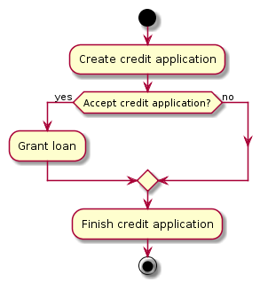

# nFlow goals and non-goals

nFlow is a light weight business process engine with emphasis on the following goals or features.

* **Conciseness:** effort put on making the writing the workflow definitions easy
* **Modularity:** you can pick the desired components from nFlow stack or use it as standalone server
* **Deployment:** startup in seconds instead of minutes, effort put on supporting many scenarios
 
nFlow non-goals are important to understand as well:

* **BPMN/BPEL Support:** excluded by the goal of conciseness
* **Full UI Support:** although read-only visualization of workflows is in future roadmap

# Getting started

## 1 minute guide

Create a Maven project. Add the following to your  `pom.xml`. nFlow is available in Maven central repository. 

```xml
<dependency>
  <groupId>com.nitorcreations</groupId>
  <artifactId>nflow-jetty</artifactId>
  <version>0.1</version>
</dependency>
```
Create a class for starting nFlow in embedded Jetty using H2 memory database.

```java
import com.nitorcreations.nflow.jetty.StartNflow;

public class App {
  public static void main(String[] args) throws Exception {
    new StartNflow().startTcpServerForH2().startJetty(7500, "dev");
  }
}
```
That's it! Running *App* will start nFlow server though without any workflow definitions. See the next sections for creating your own workflow definitions.

## Components

nFlow consist of the following main components, each having the previous component as a dependency.
 1. **nflow-engine** contains a multithreaded workflow dispatcher, Java API for managing workflows and the persistance layer implementation. 
 2. **nflow-rest** contains a JAX-RS compliant REST service implementation for exposing workflow management and query APIs.
 3. **nflow-jetty** contains an embeddable Jetty server for running nFlow with your custom workflows.

In addition, nflow-tests component contains integration tests over demo workflows.

## Usage scenarios

The following example scenarios illustrate how you can use nFlow with your applications.

### Scenario 1: embedded engine


### Scenario 2: your application server


### Scenario 3: full nFlow stack


## Anatomy of a workflow

In nFlow terminology, you have workflow definitions and instances. A workflow definition is Java class that contains the implementation of a business process (e.g. credit application process). A workflow instance is a runtime instance of the business process (e.g. credit application from a certain customer). As a developer, you need to implement the workflow definition after which the workflow instances can be submitted through nflow-engine API or nflow-rest-api services.

A workflow can be composed of human tasks (e.g. accept application), technical tasks (e.g. call REST service) or both of these tasks. A simple workflow that involves creating a credit application, the credit decision, possible money transfer and finally closing the credit application is illustrated below.



TODO: go through the code

# Configuration

## nFlow properties

Default values for nFlow properties can be overridden by adding *<env>*.properties file to classpath and specifying *env* as system property. For instance, add *dev.properties* to classpath and add *-Denv=dev* to JVM startup parameters.

TODO: table of nFlow properties and default values

## Database

PostgreSQL, MySQL/MariaDB and H2 supported...
Database structures initialized manually or automatically...
Description of database tables...

## Security

Currently nFlow does not come with any security framework. You can add your own layer of security e.g. through Spring Security if you wish.

# REST API

## Swagger

# Deployment

## Logging

## JMX

